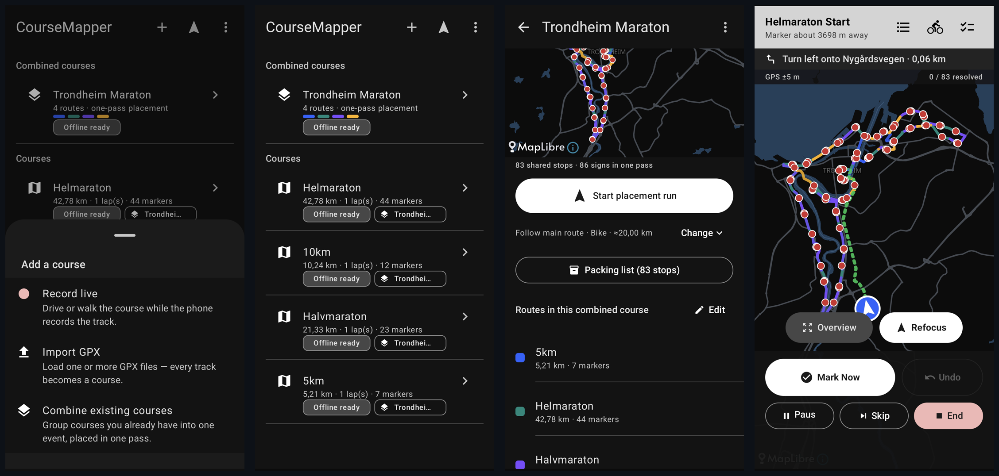

# CourseMapper

[](https://github.com/jkaberg/CourseMapper/releases/latest)
[](https://github.com/jkaberg/CourseMapper/actions/workflows/release.yml)
[](LICENSE)
[](https://developer.android.com/about/versions/oreo)
[](https://kotlinlang.org)
[](https://buymeacoffee.com/jkaberg)

Android app for placing the kilometre markers along a race course.

I help out with an local running event here in Trondheim which has a marathon, half marathon, 10 km and 5 km, and every year someone has to drive out and put up the signs for all four courses. Most of the courses share the same roads, so you end up driving the same stretch several times with an printed list of coordinates. This app fixes that - load the courses, and it figures out which signs can go up at the same spot and gives you one drive covering all of them.

[](screenshots/)

## What it does

- Import GPX files (several at once) or record the course live by driving it
- Laps and target distances, eg a 5 km loop run 4 times and trimmed to 21.0975 km
- Measured course length, so the signs follow the certified distance and not the drawn line (which is always a bit longer)
- Adjust start, finish and direction if the recording started in the car park :-)
- Marker presets (every km, start, finish, water stations etc.)
- Combine several courses into one event and place everything in one run
- Navigation between the stops, by car, bike or foot - or just along the recorded course
- Marks the stop as done when you stand at it for a few seconds, undo if it was wrong
- Offline maps, download them at home and the whole run works without signal
- Packing list, so the signs are loaded in the order you need them
- GPX export

No account and no API keys. Maps are from [OpenFreeMap](https://openfreemap.org) and routing from the [FOSSGIS](https://www.fossgis.de) Valhalla and OSRM servers.

## Install

Grab the APK from the [latest release](https://github.com/jkaberg/CourseMapper/releases/latest) and install it on the phone. Needs Android 8 or newer.

Give it location (allow all the time) and notifications on first start. Also set the app to Unrestricted under Settings -> Battery, otherwise Android will most likely kill the recording or run when the screen is off.

GPS takes a minute or so to settle after being started, so don't judge the accuracy right away.

## Usage

1. Import or record your courses
2. Pick an marker preset
3. Download the offline map (do this at home on wifi)
4. Start an placement run and drive

The settings are mostly self explanatory, the defaults work well for me on an ATV.

## Building

JDK 21 and Gradle:

```bash
./gradlew assembleDebug
```

More details in [DEVELOPMENT.md](DEVELOPMENT.md).

## Contributing

Issues and PRs are welcome, however please include logs if something is broken. If you want an feature, open an issue first so we can discuss it.

## License

[MIT](LICENSE)

If this saves you some driving, feel free to buy me a coffee :-)

<a href="https://buymeacoffee.com/jkaberg"></a>
